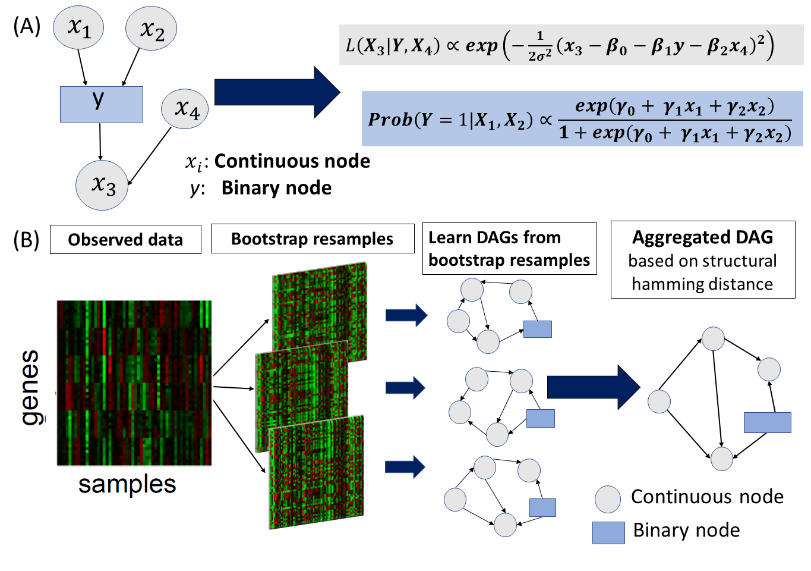

# DAGBagM: Learning Directed Acyclic Graphs via Bootstrap Aggregation for Mixture of Continuous and Binary Variables



## Cotents
- [Overview](#Overview)
- [Installation](#Installation)
- [Usage](#Usage)
- [Arguments](#Arguments)
- [Value](#Value)
- [Examples](#Examples)
- [Contributions](#contributions)


## Overview
```
This repository contains two folders. 

dagbagM: 
contains the R package "dagbagM" for learning directed acycic graphs for mixture of continuous and binary variables

Simulation_scripts: 
contains the R scripts for replicating the simulation results in the manuscript.
```


## Installation


### Install dagbagM
```
library(devtools)
install_github("jie108/dagbagM",subdir="dagbagM")
```


## Usage

```
dagbagM

hc: A function to learn a DAG model for the given data with no bootstrap resamples by the hill climbing algorithm for mixture of continuous and binary variables

dagbagM::hc(Y,nodeType, whiteList, blackList, tol, standardize, maxStep, restart, seed,  verbose)


hc_boot_parallel: A function to learn a DAG model for every bootstrap resmples of the given data by the hill climbing algorithm for mixture of continuous and binary variables

dagbagM::hc_boot_parallel(Y, node.type, n.boot, whiteList, blackList, maxStep, standardize, tol, restart, seed, nodeShuffle, numThread, verbose)

score_shd: A function to use structural hamming distance to aggregate DAGs. It aggregates an ensemble of DAGs to obtain a DAG that minimizes the overall distance to the ensemble.

score_shd(boot.adj, alpha, threshold, max.step, blacklist, whitelist, verbose)
```


## Arguments

### Arguments for dagbagM::hc and dagbagM::hc_boot_parallel
  
| Parameter                 | Default       | Description   |	
| :------------------------ |:-------------:| :-------------|
| Y	       |	           | an n by p data matrix: n – sample size, p – number of variables
| n.boot (only for hc_boot_parallel) |      1       | an integer: the number of bootstrap resamples of the data matrix Y
| node.type  		       |  NULL       | a vector of length equal to the number of variables specifying the type of variable/node type: "c" for continuous and "b" for binary
| whitelist          | NULL   |  a p by p 0-1 matrix: if the (i,j)th-entry is "1", then the edge i–>j will always be included in the DAG during the search
| blacklist	         | NULL    | a p by p 0-1 matrix: if the (i,j)th-entry is "1", then the edge i–>j will be excluded from the DAG during the search
| standardize |  TRUE | logical: whether to standardize the data to have mean zero and sd one
| tol     |     1e-06     | a scalar: a number to indicate a threshold below which values will be treated as zero
| maxStep		           | 2000    |an integer: the maximum number of search steps of the hill climbing algorithm
| restart | 10 | an integer: number of times to restart the search algorithm after a local optimal is achieved. The purpose is to search for global optimal
|seed| 1 | an integer: seed used for bootstrap restart and bootstrap resampling
|nodeShuffle (only for hc_boot_parallel) | TRUE | logical: whether to shuffle the order of the variables before DAG learning
| numThread (only for hc_boot_parallel) | 2 |  an integer for running parallel computation of DAG learning from bootstrap resamples
| verbose		     | FALSE   | logical: whether print the step information


### Arguments for dagbagM::score_shd
  
| Parameter                 | Default       | Description   |	
| :------------------------ |:-------------:| :-------------|
| boot.adj	       |	           | A p by p by B array, where B is the number of DAGs to be aggregated. It records the adjacency matrices. It may be the output of the "hc_boot_parallel" function.
| alpha         | 1          |a positive scalar: alpha defines which member of the gSHD family should be used to aggregate the DAGs. In general, the larger the alpha, the more aggressive of the aggregation, in that less edges are retained leading to smaller FDR and less power
| threshold 	       |	0	     |a scalar: it defines the frequency cut-off value(=(1-threshold)/2), "0" corresponds to cut-off 0.5
| max.step		           | NULL             |This is a legacy parameter and it does not have any effect 
| blacklist	         | NULL             | a p by p 0-1 matrix: if the (i,j)th-entry is "1", then the edge i–>j will be excluded from the DAG during the search
| whitelist          | NULL           |  a p by p 0-1 matrix: if the (i,j)th-entry is "1", then the edge i–>j will always be included in the DAG during the search
| verbose		     |     FALSE     | logical: whether print the step information


## Value

### Value for dagbagM::hc

a list of three components

| Object       | Description   |
| :------------------------ | :-------------|
| adjacency	  | adjacency matrix of the learned DAG
| score       | BIC score at each search step
| operations  | a matrix recording the selected operation, addition, deletion or reversal of an edge, at each search step
| deltaMin    | Minimum value of the score change at every step

### Value for dagbagM::hc_boot_parallel

an array

| Object       | Description   |
| :------------------------ | :-------------|
| adjacency	  | an array of adjacency matrices of the learned DAGs


### Value for dagbagM::score_shd

a matrix 

| Object       | Description   |
| :------------------------ | :-------------|
| adj.matrix	  | adjacency matrix of the learned DAG


  
## Examples
```
(i) DAG learning by hill climbing: no bootstrap resample
library(dagbagM)
data(example)
Y.n=example$Y # data matrix
p<- dim(Y.n)[2] # no. of nodes
true.dir=example$true.dir  #adjacency matrix of the data generating DAG
true.ske=example$true.ske  # skeleton graph of the data generating DAG

temp<- dagbagM::hc(Y=Y.n,nodeType=rep("c",p), whiteList=NULL, blackList=NULL, tol = 1e-6, standardize=TRUE, maxStep = 1000, restart=10, seed = 1,  verbose = FALSE)
adj.temp=temp$adjacency

(ii) DAG learning by hill climbing: for bootstrap resamples

library(foreach)
library(doParallel)


boot.adj<- dagbagM::hc_boot_parallel(Y=Y.n, n.boot=10, nodeType=rep("c",p), whiteList=NULL, blackList=NULL, standardize=TRUE, tol = 1e-6, maxStep = 1000, restart=10, seed = 1,  nodeShuffle=TRUE, numThread = 2,verbose = FALSE)


(iii) Bootstrap aggregation of DAGs learnt from bootstrap resamples

adj.bag=dagbagM::score_shd(boot.adj, alpha = 1, threshold=0)

sum(adj.bag==1&true.dir==0)/sum(adj.bag==1) ## FDR
sum(adj.bag==1&true.dir==1)/sum(true.dir==1) ## Power


```
## Citing DAGBagM

If you use DAGBagM in your research please consider citing us:

Chowdhury, S., Wang, R., Yu, Q. et al. DAGBagM: learning directed acyclic graphs of mixed variables with an application to identify protein biomarkers for treatment response in ovarian cancer. BMC Bioinformatics 23, 321 (2022). https://doi.org/10.1186/s12859-022-04864-y.

## Contributions

If you find small bugs, larger issues, or have suggestions, please email the maintainer at <jiepeng108@gmail.com>. Contributions (via pull requests or otherwise) are welcome.
