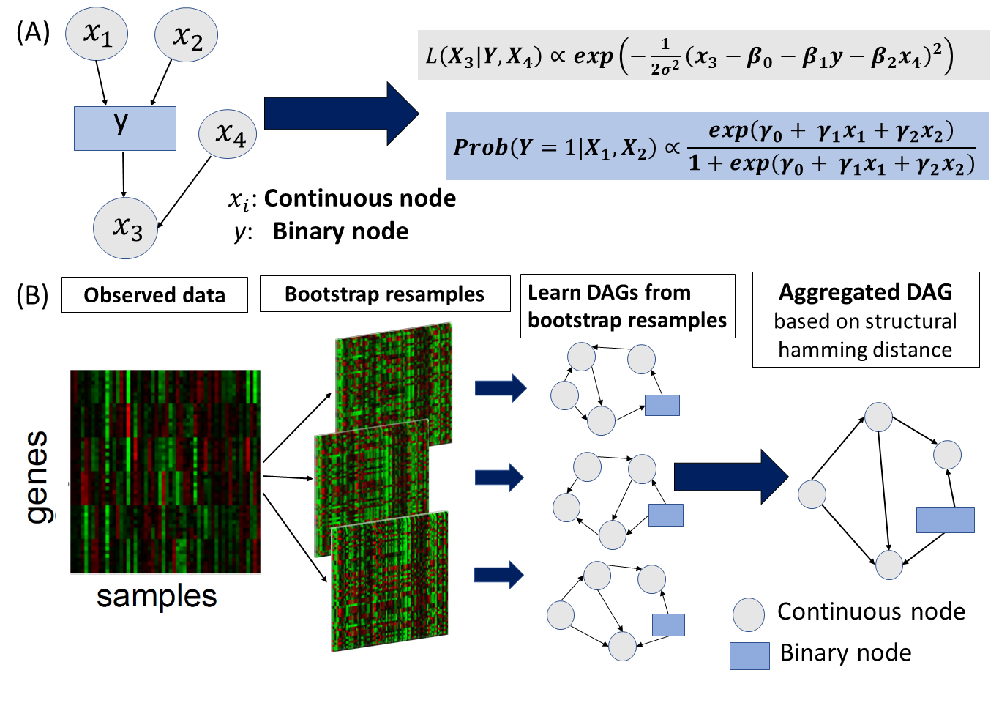

# DAGBagM: Learning Directed Acyclic Graphs via Bootstrap Aggregation for Mixture of Continuous and Binary Variables



## Contents
- [Reference](#Reference)
- [Overview](#Overview)
- [Major update disclosure](#major-update-disclosure)
- [Installation](#Installation)
- [Usage](#Usage)
- [Arguments](#Arguments)
- [Value](#Value)
- [Examples](#Examples)
- [Contributions](#contributions)

## Reference

If you use DAGBagM in your research please cite:

Chowdhury, S., Wang, R., Yu, Q. et al. DAGBagM: learning directed acyclic graphs of mixed variables with an application to identify protein biomarkers for treatment response in ovarian cancer. BMC Bioinformatics 23, 321 (2022). https://doi.org/10.1186/s12859-022-04864-y.


## Overview
```
dagbagM: 
contains the R package "dagbagM" for learning directed acyclic graphs for mixtures of continuous and binary variables

```

## Major update disclosure

This release is a major update with bug fixes, efficiency improvements, and package interface changes.

Main user interface changes:

- `hc_boot` now unifies sequential and parallel bootstrap fitting through the `future` framework.
- `hc_boot` adds `backend` and `output_type` arguments. Use `backend = "sequential"` for one-by-one fitting and `backend = "future"` for parallel fitting. Use `output_type = "array"`, `"freq"`, or `"both"` to choose the returned bootstrap output.
- `score_shd` continues to aggregate bootstrap adjacency arrays.
- `score_shd_freq` is a new function for aggregating edge-frequency outputs from `hc_boot(..., output_type = "freq")`.
- `score_shd`: Argument names changed from `whitelist` and `blacklist` to `whiteList` and `blackList`.
- `score_shd`: The frequency threshold argument changed from `threshold` to `freq.cutoff`.


## Installation

To prevent lazy loading of a previously installed version and avoid accidentally
using the old package, first remove any existing `dagbagM` installation, quit R,
restart a fresh R session, and then install the package:

```
if ("dagbagM" %in% rownames(installed.packages())) {
  remove.packages("dagbagM")
}
q()
```

After restarting R:

```
#install.packages("devtools")
library(devtools)
install_github("jie108/dagbagM",subdir="dagbagM")
```
or alternatively
```
#install.packages("remotes")
library(remotes)
remotes::install_github("jie108/dagbagM",subdir="dagbagM")
```
or install to a local library
```
.libPaths("~/R_libs")
install_github("jie108/dagbagM",subdir="dagbagM", lib = "~/R_libs")
```

After installation, check the installed version and confirm that the correct
package version `2.1` is loaded:

```
packageVersion("dagbagM")
```

## Usage

```
hc: Learn a DAG model by hill climbing for mixture of continuous and binary variables.
dagbagM::hc(Y, nodeType, whiteList, blackList, standardize, tol, maxStep, restart, seed,
              verbose, debug, addDeleteOnly)

hc_boot: Learn a DAG model for every bootstrap resample. Supports sequential and
         parallel (future multisession) execution via the backend argument.
dagbagM::hc_boot(Y, n.boot, nodeType, whiteList, blackList, standardize, tol, maxStep,
                   restart, seed, nodeShuffle, backend, workers, verbose, debug,
                   addDeleteOnly, output_type)

score_shd: Aggregate an ensemble of DAGs using generalized structural hamming distance.
dagbagM::score_shd(boot.adj, alpha, freq.cutoff, whiteList, blackList, maxStep, verbose)

score_shd_freq: Aggregate from an edge frequency matrix using generalized structural hamming distance.
dagbagM::score_shd_freq(freq, alpha, freq.cutoff, whiteList, blackList, maxStep, verbose)
```


## Arguments

### Arguments for dagbagM::hc and dagbagM::hc_boot
  
| Parameter | Default | Description |
| :--- | :---: | :--- |
| Y | | an n by p data matrix: n -- sample size, p -- number of variables |
| n.boot (hc_boot only) | 100 | an integer: the number of bootstrap resamples of the data matrix Y |
| nodeType | NULL | a vector of length p specifying the type of each variable: "c" for continuous and "b" for binary |
| whiteList | NULL | a p by p logical or 0-1 matrix: if the (i,j)th-entry is TRUE/1, the edge i-->j will always be included in the DAG |
| blackList | NULL | a p by p logical or 0-1 matrix: if the (i,j)th-entry is TRUE/1, the edge i-->j will be excluded from the DAG |
| standardize | TRUE | logical: whether to standardize continuous nodes to have mean zero and sd one |
| tol | 1e-06 | a scalar: minimum BIC improvement threshold for accepting a step |
| maxStep | 2000 | an integer: the maximum number of search steps of the hill climbing algorithm |
| restart | 1 | an integer: number of random restarts to search for a global optimum |
| seed | 1 | an integer: seed for bootstrap resampling, node shuffling, and HC tie-breaking. All randomness is derived from this one value so sequential and future backends produce identical results |
| nodeShuffle (hc_boot only) | TRUE | logical: whether to randomize node visit order within each bootstrap fit to reduce greedy-search ordering bias |
| backend (hc_boot only) | "sequential" | execution backend: "sequential" runs replicates one by one; "future" distributes them in parallel using future::multisession |
| workers (hc_boot only) | NULL | number of parallel workers for backend = "future"; NULL uses all available cores minus one, capped at n.boot |
| verbose | FALSE | logical: whether to print step information |
| debug | FALSE | logical: whether to run additional cache and acyclicity checks during HC |
| addDeleteOnly | FALSE | logical: whether to skip edge reversal candidates in HC |
| output_type (hc_boot only) | "array" | bootstrap output mode: "array" (p x p x B adjacency array), "freq" (p x p edge selection frequencies), or "both" |


### Arguments for dagbagM::score_shd and dagbagM::score_shd_freq
  
| Parameter | Default | Description |
| :--- | :---: | :--- |
| boot.adj (score_shd only) | | a p by p by B array of bootstrap DAG adjacency matrices |
| freq (score_shd_freq only) | | a p by p edge selection frequency matrix |
| alpha | 1 | a positive scalar: controls the gSHD family member used for aggregation; larger alpha retains fewer edges (lower FDR, less power) |
| freq.cutoff | 0.5 | a scalar in [0, 1]: edge selection frequency cutoff; edges with generalized selection frequency above this value are candidates for inclusion. Default 0.5 corresponds to majority-vote selection |
| whiteList | NULL | a p by p logical or 0-1 matrix: if the (i,j)th-entry is TRUE/1, the edge i-->j will always be included |
| blackList | NULL | a p by p logical or 0-1 matrix: if the (i,j)th-entry is TRUE/1, the edge i-->j will be excluded |
| maxStep | NULL | deprecated legacy parameter with no effect |
| verbose | FALSE | logical: whether to print step information |


## Value

### Value for dagbagM::hc

a list of five components

| Object | Description |
| :--- | :--- |
| adjacency | adjacency matrix of the learned DAG |
| score | BIC score for each node under the final parent configuration |
| operations | a list of 3-element vectors recording the selected operation (1=add, 2=delete, 3=reverse) at each step |
| deltaMin | score change (delta) at every accepted step |
| steps | total number of accepted steps |

### Value for dagbagM::hc_boot

depends on the `output_type` argument

| output_type | Value |
| :--- | :--- |
| "array" | a p by p by B array of bootstrap DAG adjacency matrices |
| "freq" | a p by p matrix of edge selection frequencies |
| "both" | a list with components `adjacency` (array) and `freq` (matrix) |


### Value for dagbagM::score_shd and dagbagM::score_shd_freq

| Object | Description |
| :--- | :--- |
| (matrix) | a p by p integer adjacency matrix of the aggregated DAG |


  
## Examples
### Example 1: continuous nodes from the bundled data
```
rm(list=ls())
library(dagbagM)
data(example)
Y.n <- example$Y      # data matrix
p   <- ncol(Y.n)      # number of nodes: p = 102
n   <- nrow(Y.n)      # sample size: n = 102

true.dir   <- example$true.dir        # adjacency matrix of the data-generating DAG
true.moral <- moral_graph(true.dir)   # moral graph of the data-generating DAG
true.ske   <- skeleton(true.dir)      # skeleton of the data-generating DAG
true.vstr  <- vstructures(true.dir)   # v-structures of the data-generating DAG

sum(true.dir)  # number of edges: |E| = 109

# (i) DAG learning by hill climbing: no bootstrap resample

temp     <- dagbagM::hc(Y = Y.n, nodeType = rep("c", p), whiteList = NULL,
                          blackList = NULL, tol = 1e-6, standardize = TRUE,
                          maxStep = 1000, restart = 1, seed = 1, verbose = FALSE)
adj.temp <- temp$adjacency

# Evaluations
# results on DAG estimation
sum(adj.temp==1 & true.dir==0) / sum(adj.temp==1)  ## FDR:   0.8803681
sum(adj.temp==1 & true.dir==1) / sum(true.dir==1)  ## Power: 0.3577982

# results on skeleton graph estimation
adj.temp.ske <- skeleton(adj.temp)
sum(adj.temp.ske==1 & true.ske==0) / sum(adj.temp.ske==1)  ## FDR:   0.7055215
sum(adj.temp.ske==1 & true.ske==1) / sum(true.ske==1)      ## Power: 0.8807339


# (ii) DAG learning by hill climbing: bootstrap resamples (sequential)

boot.adj <- dagbagM::hc_boot(Y = Y.n, n.boot = 100, nodeType = rep("c", p),
                               whiteList = NULL, blackList = NULL,
                               standardize = TRUE, tol = 1e-6, maxStep = 1000,
                               restart = 1, seed = 1, nodeShuffle = TRUE,
                               backend = "sequential", output_type = "array",
                               verbose = FALSE)

# For parallel execution across multiple cores, use backend = "future":
# boot.adj <- dagbagM::hc_boot(..., backend = "future", workers = 4, output_type = "array")

# (iii) Bootstrap aggregation: freq.cutoff=0.5 corresponds to 50% selection frequency cutoff
adj.bag <- dagbagM::score_shd(boot.adj, alpha = 1, freq.cutoff = 0.5)

# (iv) Evaluations
## results on DAG estimation
sum(adj.bag==1 & true.dir==0) / sum(adj.bag==1)  ## FDR:   0.4
sum(adj.bag==1 & true.dir==1) / sum(true.dir==1) ## Power: 0.5779817

## results on skeleton graph estimation
adj.bag.ske <- skeleton(adj.bag)
sum(adj.bag.ske==1 & true.ske==0) / sum(adj.bag.ske==1)  ## FDR:   0.152381
sum(adj.bag.ske==1 & true.ske==1) / sum(true.ske==1)     ## Power: 0.8165138

## results on moral graph estimation
adj.bag.moral <- moral_graph(adj.bag)
sum(adj.bag.moral==1 & true.moral==0) / sum(adj.bag.moral==1)  ## FDR:   0.1948052
sum(adj.bag.moral==1 & true.moral==1) / sum(true.moral==1)     ## Power: 0.673913

## results on v-structure estimation
adj.bag.vstr <- vstructures(adj.bag)
vstr.corr    <- compare.vstructures(target.vstructures = adj.bag.vstr,
                                    true.vstructures   = true.vstr)
1 - nrow(vstr.corr) / nrow(adj.bag.vstr)  ## FDR:   0.34
nrow(vstr.corr) / nrow(true.vstr)         ## Power: 0.4285714
```

### Example 2: binary node with two continuous parents

This example starts from two continuous variables in `data(example)`, then adds
one binary child generated from both continuous parents. It uses
`hc_boot(..., output_type = "freq")` and aggregates directly with
`score_shd_freq()`.

```
library(dagbagM)
data(example)

Y0 <- example$Y[, 1:2]
colnames(Y0) <- c("parent1", "parent2")

set.seed(123)
eta <- 0.9 * scale(Y0[, "parent1"]) - 0.7 * scale(Y0[, "parent2"])
binary_child <- rbinom(nrow(Y0), size = 1, prob = plogis(eta))

Y.mix <- cbind(Y0, binary_child = binary_child)
nodeType.mix <- c("c", "c", "b")

# The data-generating parent set is parent1 -> binary_child <- parent2.
whiteList.mix <- matrix(FALSE, 3, 3)
colnames(whiteList.mix) <- rownames(whiteList.mix) <- colnames(Y.mix)
whiteList.mix[c("parent1", "parent2"), "binary_child"] <- TRUE

fit.mix <- dagbagM::hc(Y = Y.mix, nodeType = nodeType.mix,
                       whiteList = whiteList.mix,
                       standardize = TRUE, tol = 1e-6,
                       maxStep = 1000, restart = 1,
                       seed = 2, verbose = FALSE)
fit.mix$adjacency

boot.freq.mix <- dagbagM::hc_boot(Y = Y.mix, n.boot = 100,
                                  nodeType = nodeType.mix,
                                  whiteList = whiteList.mix,
                                  standardize = TRUE, tol = 1e-6,
                                  maxStep = 1000, restart = 1,
                                  seed = 2, nodeShuffle = TRUE,
                                  backend = "sequential",
                                  output_type = "freq",
                                  verbose = FALSE)

adj.bag.mix <- dagbagM::score_shd_freq(freq = boot.freq.mix,
                                       alpha = 1,
                                       freq.cutoff = 0.5,
                                       whiteList = whiteList.mix)
adj.bag.mix
```

## Contributions

If you find small bugs, larger issues, or have suggestions, please email the maintainer at <jiepeng108@gmail.com>. Contributions (via pull requests or otherwise) are welcome.
